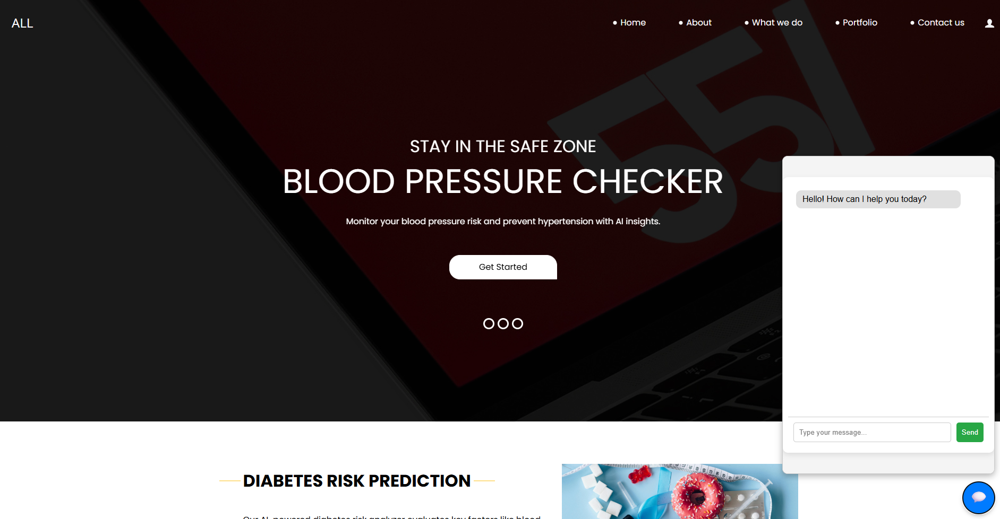
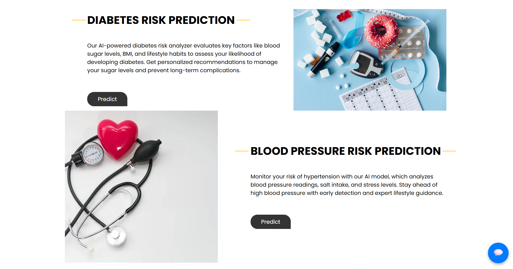
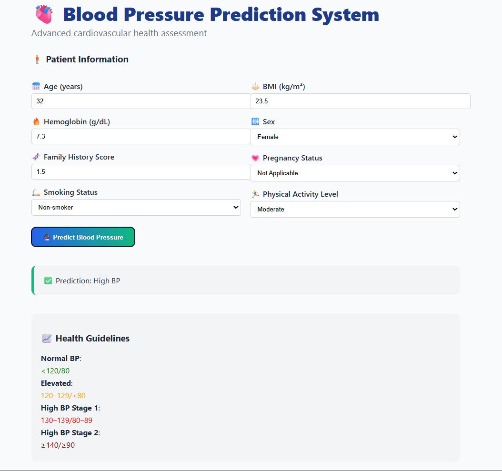

# 🩺 Health Risk Prediction Web App

This web application helps predict various health risks such as:

- 🔵 **Diabetes**
- 🔴 **Heart Attack**
- ⚠️ **High Blood Pressure**
- 🥗 **Personalized Diet Plans**
- 💬 **Integrated Chatbot Assistant**

---

## 🌐 Features

✅ Multiple disease risk predictions  
✅ Responsive user interface  
✅ FastAPI + Flask integration  
✅ Gemini / OpenAI chatbot (bottom-right)  
✅ Clean HTML/CSS templates  
✅ Meal Plan Recommendation

---
## 🛠️ Tech Stack

- **Frontend**: HTML, CSS, JavaScript
- **Backend**: Flask, FastAPI
- **ML Models**: Trained using Scikit-learn
- **AI Chatbot**: Gemini API (or OpenAI GPT)
- **Libraries**: Pandas, Numpy, Scikit-learn
- **Deployment**: Localhost (Flask server)

## 🖼️ Screenshots

### 🔹 Home Page

### 🔹 Diabetes,heart Prediction Models

### 🔹 Blood Pressure Prediction Result

### 🔹 Diet Plan 

